= OSS-DBメモ

[cols="^.^1,3", options="header"]
|===
|項目 |内容

|GRANT REVOKE 書式
|GRANT 権限 ON テーブル名 TO {ユーザ名 \| PUBLIC}; +
GRANT 権限 ON DATABASE データベース名 TO {ユーザ名 \| PUBLIC}; +
GRANT 権限 ON SCHEMA スキーマ名 TO {ユーザ名 \| PUBLIC}; +

REVOKE 権限 ON テーブル名 FROM {ユーザ名 \| PUBLIC}; +
REVOKE 権限 ON DATABASE データベース名 FROM {ユーザ名 \| PUBLIC}; +
REVOKE 権限 ON SCHEMA スキーマ名 FROM {ユーザ名 \| PUBLIC}; +

どちらも"ON"があるので注意

|createdb のオプションで一つだけ小文字のやつがいる
|createdb では"O"や"E"などでオプションの指定が可能だが、ロケールの設定だけ"L"ではなく"l"で、小文字なので注意。 +
どうやら歴史的な背景があるらしい。

|postgresql.conf 注意パラメータ４つ
|listen_address +
port +
max_connections +
logging_collector +
上記４つはpostgreSQLの再起動でしか反映されないので注意。 postgresql.confの再読み込みでは反映されない。

|IF と CASE
|PostgreSQLでは純粋なSQLでは"IF"は使えない。 "IF"は使えるのは関数やプロシージャ内のみ。 +
関数やプロシージャ内では、"IF"と"CASE"はどっちも使える。 +

(CASE書式) +

-- 検索CASE式（条件式を評価） +
CASE +
  WHEN 条件1 THEN 値1 +
  WHEN 条件2 THEN 値2 +
  ELSE 値3 +
END +

-- 単純CASE式（式の値を比較） +
CASE 式 +
  WHEN 値1 THEN 結果1 +
  WHEN 値2 THEN 結果2 +
  ELSE 結果3 +
END +

最後に"END"が必要であることを忘れないこと！！

|pg_dump と pf_dump all の出力形式の違い
|pg_dump ではオプションでカスタム形式やディレクトリ形式、tar形式といった指定ができるが、 +
pg_dump all はテキスト形式のみで、指定ができない。

|SQL の"\|\|"と C# の"\|\|"
|C#で"\|\|"は「または」を表すが、SQLでは「\|\|」は左右の文字列を連結する演算子を表す。 +
だから、 SELECT * FROM sample WHERE name = 'SATO' \|\| ' ' \|\| 'HITOMI'; +
このSQLを実行すると、「sample」テーブルの「name」カラムが「SATO HITOMI」の行が取得される。 +
「sample」テーブルの「name」カラムが「SATO」または「 」または「HITOMI」の行が取得されるわけではない。

SQLで「または」を使いたい場合は普通に"OR"を使う。

|EXIST の副問い合わせに条件が指定されている場合と指定されていない場合
|EXISTSの副問い合わせに条件が指定されていない場合は、副問い合わせが真の場合は全件取得。 +
副問い合わせに条件が指定されている場合は、その条件に合致する行のみ取得。 +
(例) +
SELECT * FROM users WHERE EXISTS (SELECT * FROM dept); +
↑この場合は副問い合わせが真なら全件取得。 

SELECT * FROM users WHERE EXISTS (SELECT * FROM dept WHERE users.部署id = dept.部署id); +
↑この場合は副問い合わせの条件(users.部署id = dept.部署id)に合致する行だけが取得される。

|オフライン/オンラインバックアップ
|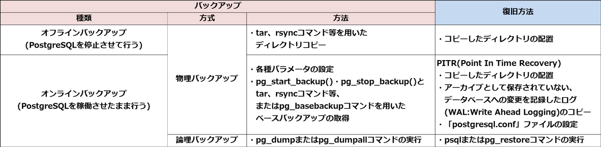

|CREATE SUBSCRIPTION を行うと PUBLISHER側におこること
|CREATE SUBSCRIPTION が実行されると、PUBLISHER側に自動的にレプリケーションスロット（データ同期を管理する仕組み）が作成されます。

|FULL と RIGHT と LEFT
|FULLは条件に一致しなくても両方のテーブルから取ってくる。 +
RIGHTは右。 LEFTは左。

|トランザクション制御文があるプロシージャと、ないプロシージャ
|トランザクション制御文があるプロシージャはCALLされた際に暗黙的にプロシージャ専用のトランザクションが開始される。 +
トランザクション制御文が無いプロシージャはCALLされても専用のトランザクションは開始されず、呼び出し側のトランザクションに従属する。 +

呼び出し側でBEGINで明示的にトランザクションを開始した場合、前者のプロシージャは呼び出せない。 +
これは、PostgreSQLはネストされたトランザクションをサポートしていないためである。 +
後者は問題なく呼び出せる。 +

ちなみに関数はトランザクション制御文が書けないので、問題なく呼び出せる。

|psqlの操作レイヤー３つ（なんかややこしいから適当）
|Q:なんかややこしいな。 
psqlを起動してSQLを実行する方法と、
OSコマンドラインからpsqlコマンド起動してファイル流す方法と、
ユーティリティコマンド実行する方法で、３つくらいない？

A:そうそう、その整理の仕方が一番わかりやすいです 👍 PostgreSQLの操作は大きく分けて 3つのレイヤー があると考えるとスッキリします。

1️⃣ psqlを起動してSQLを実行する（対話型）
流れ：OSのコマンドラインから psql を起動 → 対話型シェルに入る → SQLやメタコマンドを入力。

bash
psql -U postgres -d mydb
sql
SELECT * FROM mytable;
\dt
特徴：セッションが維持され、ユーザーが自由に操作できる。

2️⃣ OSコマンドラインからpsqlを起動してファイルや1文を流す（バッチ型）
流れ：OSのコマンドラインで psql にオプションを付けて一括実行。

例：

bash
psql -U postgres -d mydb -f sample.sql
psql -U postgres -c "SELECT * FROM mytable;"
特徴：指定したSQLファイルや文を処理したら psqlは終了。

--single-transaction や --single-step など安全確認用のオプションが使える。

3️⃣ ユーティリティコマンドを実行する（管理用ラッパー）
流れ：PostgreSQLに付属する専用ユーティリティをOSのコマンドラインから呼び出す。

例：

bash
createdb mydb
dropuser -i myuser
vacuumdb --all --analyze
特徴：SQL文を直接書かなくても管理操作ができる。

-i のような確認オプションを持つものもある。

管理作業を簡略化するためのラッパー。

✅ まとめ
① 対話型 psql → セッションを維持して手入力。

② バッチ型 psql → OSからファイルや1文を流して即終了。

③ 管理ユーティリティ → createdb, dropuser, vacuumdb など専用コマンド。

Q:２番の方法では、-iオプションは使えないの？

A:そう、そこがポイントです。

🔍 2番の「psqlをOSコマンドラインから起動してファイルや1文を流す方法」について
この方法では psql クライアントの起動オプションしか使えません。

psql のオプションには -U, -d, -f, -c, --single-transaction, --single-step などがありますが、-i は存在しません。

❌ なぜ -i が使えないのか
-i は dropuser や createuser などの管理ユーティリティ専用のオプションで、「削除前に確認する」ためのもの。

psql は「SQLを流すクライアント」なので、確認オプションは持たず、代わりに --single-step で「1文ずつ実行前に確認」できます。

✅ まとめ
2番の方法（psqlでファイル流す） → -i は使えない。

確認したいなら --single-step を使う。

-i があるのは管理ユーティリティ（dropuserなど）だけ。

|psqlコマンド
|psqlコマンドは、OSのコマンドラインから実行する。 +
実行すると、psqlを起動して、指定のコマンドを実行する。 +
コマンドが実行し終えると、psqlは終了する。 +
ちなみに、 -i オプションとかはOSのコマンドラインから実行するときのみ使用できる。 +
SQLにはそのようなオプションはない

|SQLのVACUUM と、 ユーティリティコマンドのvacuumdb
|vacuumdb は PostgreSQL に付属するユーティリティコマンドで、
SQL の VACUUM をラップしてデータベース全体や複数データベースに対して不要領域の回収や統計情報更新を行えるツールです。

🔍 基本概要 +
役割：不要領域（デッドタプル）の掃除と、問い合わせオプティマイザ用の統計情報生成。 +
性質：SQL の VACUUM コマンドをラップしたものなので、機能的には同じ。ただし、現在接続しているデータベースにしか影響を及ぼせないVACUUMと比較すると、
複数データベースをまとめて処理できる点が便利。 +
利用場面：夜間バッチやメンテナンススクリプトで「全データベースを一括で VACUUM」したいときに使われる。

|プロシージャの暗黙的トランザクションと、関数ではトランザクション制御文が書けない
a|1. 関数（CREATE FUNCTION） +
関数は 呼び出し元のトランザクションに従属するので、トランザクション制御文（BEGIN; COMMIT; ROLLBACK;）は書けません。 +

-- 関数の例 +
CREATE FUNCTION sample_func() +
RETURNS void +
LANGUAGE plpgsql +
AS $$ +
BEGIN +
pass:[&nbsp;&nbsp;&nbsp;&nbsp;]    INSERT INTO tbl01 (c1) VALUES (100); +

pass:[&nbsp;&nbsp;&nbsp;&nbsp;]    -- ❌ NG: 関数内ではトランザクション制御文は使えない +
pass:[&nbsp;&nbsp;&nbsp;&nbsp;]    -- COMMIT; +
pass:[&nbsp;&nbsp;&nbsp;&nbsp;]    -- ROLLBACK; +
END; +
$$; +

この関数を呼び出すときは、外側で BEGIN/COMMIT を書く必要がある。 +
つまり「関数はトランザクション責任を持たず、呼び出し元に従う存在」です。 +

2. プロシージャ（CREATE PROCEDURE） +
プロシージャは 自分の中でトランザクション制御文を書けるのが特徴です。 +

-- プロシージャの例 +
CREATE PROCEDURE sample_proc() +
LANGUAGE plpgsql +
AS \$$ +
BEGIN +
pass:[&nbsp;&nbsp;&nbsp;&nbsp;]   FOR i IN 1..5 LOOP +
pass:[&nbsp;&nbsp;&nbsp;&nbsp;]pass:[&nbsp;&nbsp;&nbsp;&nbsp;]        INSERT INTO tbl01 (c1) VALUES (i); +

pass:[&nbsp;&nbsp;&nbsp;&nbsp;]pass:[&nbsp;&nbsp;&nbsp;&nbsp;]        IF i % 2 = 0 THEN +
pass:[&nbsp;&nbsp;&nbsp;&nbsp;]pass:[&nbsp;&nbsp;&nbsp;&nbsp;]pass:[&nbsp;&nbsp;&nbsp;&nbsp;]            COMMIT;   -- ✅ OK: プロシージャ内でトランザクションを終了できる +
pass:[&nbsp;&nbsp;&nbsp;&nbsp;]pass:[&nbsp;&nbsp;&nbsp;&nbsp;]        ELSE +
pass:[&nbsp;&nbsp;&nbsp;&nbsp;]pass:[&nbsp;&nbsp;&nbsp;&nbsp;]pass:[&nbsp;&nbsp;&nbsp;&nbsp;]            ROLLBACK; -- ✅ OK: プロシージャ内でトランザクションを破棄できる +
pass:[&nbsp;&nbsp;&nbsp;&nbsp;]pass:[&nbsp;&nbsp;&nbsp;&nbsp;]        END IF; +
pass:[&nbsp;&nbsp;&nbsp;&nbsp;]    END LOOP; +
END; +
$$; +

この場合、プロシージャを呼び出すと 暗黙的にトランザクションが開始され、 +
ループの中で COMMIT や ROLLBACK をすると、その時点でトランザクションが終了し、 +
次のループから新しいトランザクションが始まります。 +

|トランザクションを開始するBEGINとプロシージャ内のBEGIN
|1. PL/pgSQL の BEGIN ... END +
これは コードブロックの開始と終了を示すだけです。 +

例：CREATE PROCEDURE ... AS $$ BEGIN ... END; $$; + 
→ この BEGIN は「この中がプロシージャ本体ですよ」という意味で、トランザクションとは無関係です。 +

2. SQL の BEGIN +
これは トランザクションを明示的に開始する宣言です。 +

通常は BEGIN; ... COMMIT; で使い、複数の SQL をひとまとめにして「成功なら全部反映、失敗なら全部取り消し」という単位を作ります。

|同じ物理バックアップでもDBを停止する必要があるものと無いもの
|1. 単純コピー（例：tar や cp） +
データディレクトリをそのままコピーする方法 +
稼働中に行うとファイルが更新され続けるため 整合性が崩れる可能性が高い +
この場合は 停止してからバックアップするのが安全1. 単純コピー（例：tar や cp） +
データディレクトリをそのままコピーする方法 +
稼働中に行うとファイルが更新され続けるため 整合性が崩れる可能性が高い +
この場合は 停止してからバックアップするのが安全 +
また、非排他モードでは同時実行可能となる

2. 専用ツール（例：PostgreSQLの pg_basebackupやpg_start_backup()） +
稼働中でも整合性を保ったバックアップが可能 +
WALログを併用することで、停止せずに完全な物理バックアップを取得できる +

まとめ +
停止が必要なのは「単純コピー」方式 +
停止不要なのは「専用ツール」方式 +
責務分離が明快で、 +
「安全性重視 → 停止」 +
「可用性重視 → 稼働中バックアップ」 と選択できる設計になっています。 +

|ROLLBACKとROLLBACK TO SAVEPOINT
|BEGIN; +
INSERT INTO sample VALUES(1, 'test'); +
SAVEPOINT s1;  +
INSERT INTO sample VALUES(2, 'test'); +
SAVEPOINT s2; +
INSERT INTO sample VALUES(3, 'test'); +
SAVEPOINT s3; +
DELETE FROM sample WHERE no = 2;  +
SAVEPOINT s4;  +
ROLLBACK TO s2; +
DELETE FROM sample WHERE no = 1; +
COMMIT; +
これって10行目のROLLBACKでBEGINで開始したトランザクションは終了しますよね

いい質問です。結論から言うと、10行目の ROLLBACK TO s2; ではトランザクションは終了しません。

🔍 詳細解説
BEGIN; トランザクションを開始します。ここから COMMIT または ROLLBACK が出るまで継続します。 +
SAVEPOINT s2; トランザクション内に「巻き戻し可能なポイント」を設定します。 +
ROLLBACK TO s2; トランザクション全体を終了するのではなく、トランザクションを継続したまま、状態を「s2 の時点」に戻す操作です。 +
→ つまり、s2 以降の操作（INSERT(3, 'test') と DELETE no=2）は取り消されますが、トランザクション自体はまだ生きています。 +
その後の DELETE FROM sample WHERE no = 1; ROLLBACK TO s2; の後もトランザクションは続いているので、この削除は有効です。 +
最後の COMMIT; ここで初めてトランザクションが終了し、確定します。

✨ 設計美的ポイント +
青真さんの視点で整理すると： +
ROLLBACK TO SAVEPOINT は「部分的な巻き戻し」 +
ROLLBACK は「トランザクション全体の終了」 +
COMMIT は「トランザクションの確定」 +
つまり責務分離が明快で、 +
「全体を終わらせる」か +
「途中まで戻す」か を明確に選べる設計になっています。

✅ まとめると、10行目の ROLLBACK TO s2; は トランザクションを終了しない、あくまで「s2 の時点に戻す」だけです。終了するのは最後の COMMIT; です。 +
ROLLBACK TO と ROLLBACKは別の文法となります。

|情報スキーマとは
|情報スキーマとは、データベースクラスタに関する情報の確認に使用する仕組みです。 +
データベースオブジェクトに関する定義情報を含むスキーマ(テーブルなどのオブジェクトを格納している名前空間)を指します。 +
[red]#スーパーユーザに所有される#、ビュー(SQL文のSELECT結果を基にして定義する仮想のテーブル)とテーブルのグループであり、 +
SQLの標準規格に当てはまるために移植性が高いという特徴を持ちます。 +
システムカタログとは異なり、[red]#参照に特別な設定や権限は不要です。#

|グローバルオブジェクトとpg_dump
|PostgreSQLにおける「グローバルオブジェクト」とは、クラスタ全体で共有されるオブジェクトのことです。 +
代表例は「データベースロール（ユーザーや権限）」と「テーブルスペース」です。 +
これらは特定のデータベースに属さず、クラスタ内のすべてのデータベースから利用できます。

🔑 グローバルオブジェクトの具体例 +
データベースロール（ユーザー／権限）

PostgreSQLではユーザーやグループを「ロール」として管理します。 +
ロールはクラスタ全体で共通なので、どのデータベースに接続しても同じロールが使えます。

テーブルスペース +
データベースやオブジェクトを格納する物理的な場所を定義する仕組み。 +
クラスタ全体で共有され、複数のデータベースが同じテーブルスペースを利用可能。

クラスタ共通テーブル +
PostgreSQLのデータディレクトリには global というサブディレクトリがあり、ここにクラスタ全体で共有されるテーブル（例：pg_database）が格納されています。

📂 データベースクラスタとの関係 +
PostgreSQLは「クラスタ」という単位で管理され、クラスタには複数のデータベースが含まれます。 +
各データベースは独立したスキーマやテーブルを持ちますが、グローバルオブジェクトはクラスタ全体で共通です。 +
そのため、バックアップツール pg_dump では個別データベースの内容しか保存できませんが、 +
pg_dumpall を使うとクラスタ全体のバックアップとともにグローバルオブジェクトも保存されます。

💡 まとめ +
グローバルオブジェクト = クラスタ全体で共有されるもの +
主な対象は ロール（ユーザー／権限） と テーブルスペース。 +
データベース固有のテーブルやスキーマとは異なり、クラスタ全体の「共通設定・共通資産」として扱われる。

ちなみに、pg_dumpallはオプションを指定することでグローバルオブジェクトのみを対象にバックアップすることができる。

|INとNOT IN
|次のクエリは同義である +
select * from member where 部署 in ('営業', '開発', '総務'); +
select * from member where 部署 = '営業' or 部署 = '開発' or 部署 = '総務';

select * from member where 部署 NOT IN ('営業', '開発', '総務'); +
select * from member where 部署 <> '営業' and 部署 <> '開発' and 部署 <> '総務'; +
（ちなみに<>はSQLでは「≠」を意味する。 Postgreの場合は != でもOK）

|ユニーク制約を持つカラムへのNULL挿入
|ユニーク制約を持つカラムにNULLを挿入する場合、複数のレコードにNULLを挿入可能であり、NULL値は重複してもユニーク制約違反にならない。 +

🔍 理由 +
PostgreSQLは、SQL標準に準拠しており、NULL は「未知の値」として扱われます。

UNIQUE 制約は「既知の値が重複していないこと」を保証するものであり、NULL は比較できない（NULL = NULL は FALSE ではなく UNKNOWN）ため、複数の NULL は互いに等しいとは見なされません。 +

CREATE TABLE sample ( +
    id SERIAL PRIMARY KEY, +
    email TEXT UNIQUE +
); +

INSERT INTO sample (email) VALUES (NULL); -- OK +
INSERT INTO sample (email) VALUES (NULL); -- OK（2つ目のNULLも許容される） +
INSERT INTO sample (email) VALUES ('test@example.com'); -- OK +
INSERT INTO sample (email) VALUES ('test@example.com'); -- エラー（重複） +

|ラージオブジェクト
|PostgreSQLには、ラージオブジェクトという巨大なバイナリ・テキストデータを格納できる機能があります。 +
格納先はシステムカタログの「pg_largeobject」テーブルとなり、ユーザテーブルに格納されたOIDによって紐づけられます。 +
ラージオブジェクトを格納すると、そのOIDが返されます。 +
扱うことのできるデータサイズ上限はver9.3以降で4TBです。 +
ラージオブジェクトの格納・取得は、\lo_import、\lo_exportコマンドで行います。

|新規データベースのTemplate0 と Template1
|新しいデータベースを作成する際、-Tオプションでデータベースのひな形となるテンプレートを指定できます。このテンプレートとは、データベースクラスタを作成した時のtemplate0とtemplate1です。何も指定しない場合は、template1になります。エンコーディングとロケールは、テンプレートの設定を引き継ぎます。 +
template1を指定した場合、template1に設定されたエンコーディングとロケールは変更ができません。 +
エンコーディングとロケールをテンプレートとは別の設定にしたい場合は、template0を指定した上で、-E、-lオプションを使用し変更します。 +
template0以外のテンプレートは、-E、-lオプションを使用して変更しようとしても、createdbコマンドは失敗します。

|定義したスキーマへのアクセス
|定義した特定のスキーマにアクセスしたい場合、search_pathパラメータに対象のスキーマを指定することができます。パラメータには複数のスキーマを設定することができ、[red]#左側に記載されているスキーマから優先的にアクセスされます。# +

次のテーブルが存在します +
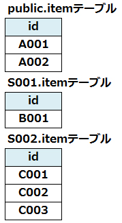 +
以下のSQL文を実行します +

SET search_path TO S001,public,S002; +
SELECT count(*) FROM item; +

この場合、S001スキーマのitemテーブルが参照されます。
そのため、結果はS001スキーマのitemテーブルのレコード数である1が返されます。

|INSERT文にSELECT文を組み合わせる
|INSERT文でtableに新たなデータを挿入する際、SELECT文を組み合わせることができる。 +
これをすると、VALUE句を使用せずに、データの挿入が可能となる。使い方は以下の画像を参考に。 +
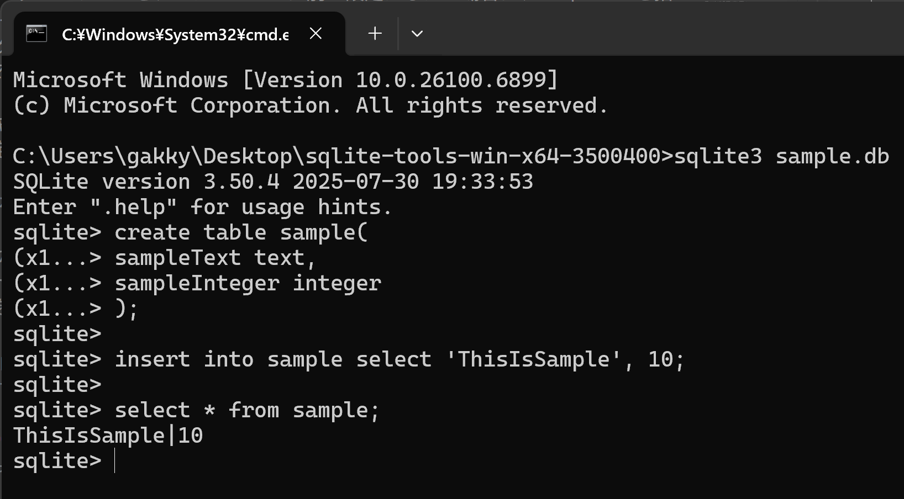

|drop user 書式
|スーパーユーザ「postgres」としてデータベースユーザ「user」を削除したい。正しいコマンドは +
・dropuser -U postgres user +
・dropuser -U postgres -i user +
スーパユーザ名を指定する場合は「-U」オプションを使用することに注意。

|スキーマの自動作成
|PostgreSQLではデータベースクラスタの作成時にデフォルトでpublicスキーマが作成されます。

|INTERVAL型
|INTERVAL型は、単位を明示しない、またはキャストを行わない場合、デフォルトで「秒」として扱われる。 +
なので、もし「現在時刻の３か月前の日時を取得したい場合は、次のように記述する必要がある。 +
SELECT now() - '3 month'::interval; +
SELECT now() - interval '3 month'; +

|COPYコマンドとスーパユーザ権限
|\copyコマンドは実行に特別な権限を必要としませんが、COPYコマンドでファイルを指定する場合はスーパーユーザ権限が必要になります。 標準出力へのコピーはCOPYコマンドであってもスーパーユーザ権限は不要です。 +
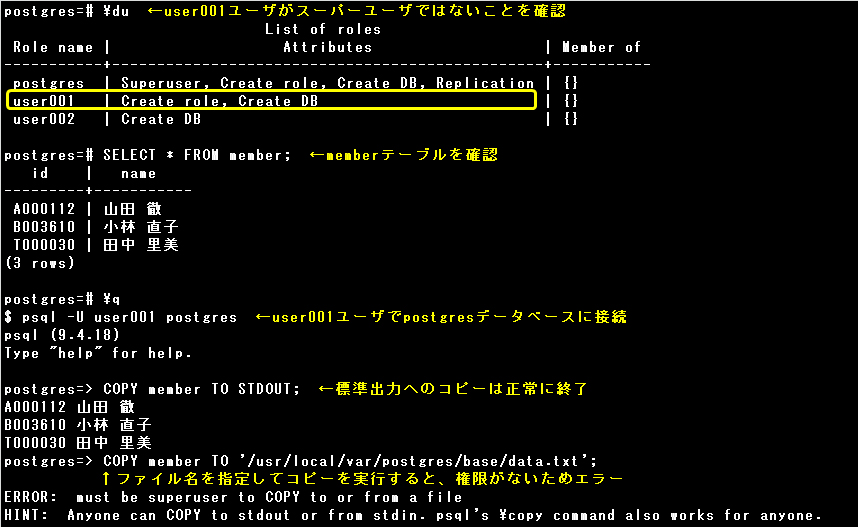

|postgre.confのパラメータと反映タイミング
|image:postgre.confパラメータと反映タイミング.jpg[]

|FOR EACH ROW と FOR EACH STATEMENT
|トリガーを定義する際、FOR EACH ROW と FOR EACH STATEMENT の2種類のオプションがある。 +
FOR EACH ROW は、対象テーブルの各行に対してトリガーが実行される。 +
FOR EACH STATEMENT は、対象テーブルに対して1回だけトリガーが実行される。 +
例えば、対象テーブルに10行のデータが挿入された場合、 +
FOR EACH ROW では10回トリガーが実行されるが、 +
FOR EACH STATEMENT では1回だけトリガーが実行される。 +
省略した場合、FOR EACH STATEMENTがデフォルトとなる。

|デフォルトのスキーマ
|PostgreSQLでは、データベースを新規作成すると通常「3〜6個程度のスキーマ」がデフォルトで存在します。主に public、pg_catalog、information_schema などが含まれます。 +

[cols="^.^1,3", options="header"]
!===
!スキーマ名 !説明
!public !デフォルトで作成されるスキーマ。ユーザが作成したオブジェクトは、特に指定しない限りこのスキーマに格納される。 
!pg_catalog !PostgreSQLのシステムカタログが格納されているスキーマ。データベースのメタデータ（テーブル定義、ユーザ情報、権限情報など）が含まれる。
!information_schema !SQL標準に準拠したメタデータが格納されているスキーマ。異なるデータベースシステム間での互換性を提供するために使用される。
!pg_toast !大きなデータ型（TOAST: The Oversized-Attribute Storage Technique）を格納するためのスキーマ。大きなテキストやバイナリデータが含まれる。
!pg_temp_nnn !一時スキーマ。セッションごとに異なる番号が付与され、一時テーブルや一時オブジェクトが格納される。
!pg_internal !PostgreSQLの内部使用専用のスキーマ。通常、ユーザが直接操作することはない。 
!===

|template0とtemplate1の使い分け
|エンコーディングやロケール等、データベース作成前に設定する項目を変更したデータベースを作成したい場合は、template0を指定してデータベースを作成する。 +
テーブルやスキーマ構造、関数などのデータベース作成後に設定できる項目を変更したデータベースを作成したい場合は、template1を指定してデータベースを作成する。 +

|トリガーの定義単位
|トリガーはテーブルごとに作成される。 データベースごとではない。
これは、トリガーの基本構造が、P特定のテーブルに対して「ある操作（INSERT、UPDATE、DELETEなど）が行われたとき」に自動的に実行されるようになっているからである。 +
だからONで対象テーブル名を指定する必要がある。 +
CREATE TRIGGER トリガー名 +
AFTER （またはBEFORE） INSERT OR UPDATE ON 対象テーブル名 +
FOR EACH ROW （またはFOR EACH STATEMENT） +
EXECUTE FUNCTION 関数名();

|psqlの正体
|psql は PostgreSQL に付属する 公式のコマンドラインツールで、Windowsで「SQL Shell」として表示されているものの正体が psql です。 +
psql は PostgreSQL に接続して、SQL文を実行したり、メタコマンド（\dt や \l など）を使ってデータベースを操作できるツールです。 +
Windowsでは「SQL Shell (psql)」という名前でショートカットが作られていますが、実行されているのは psql.exe です。

|メタコマンドとSQLコマンドの違い
|** 🧠 メタコマンドとは（\ で始まるコマンド） +
* psql（SQL Shell）専用のコマンド
* PostgreSQLの操作や情報取得を簡単にする補助コマンド
* SQL文ではないので、セミコロン（;）は不要 +

** 🧾 SQL文とは（SELECT や INSERT など）
* PostgreSQLの標準SQL構文
* データの操作や定義を行う本命コマンド
* セミコロン（;）で終わる必要がある
[cols="^.^1,3,3", options="header"]
!===
!比較項目 !メタコマンド !SQL文
!書式	!\ で始まる	!通常のSQL構文
!対象	!psql の操作	!データベースの操作
!セミコロン	!不要	!必要
!実行場所	!psql 内のみ	!psql でもアプリでもOK
!例	!\dt, \q	!SELECT, INSERT
!===

|[red]#PostgreSQLのユーティリティコマンド一覧#
|pg_dump等、psqlでは実行できず、OSのコマンドラインから実行するコマンドをユーティリティコマンドと呼ぶ。 +
主なユーティリティコマンドは以下の通り。 +

**バックアップ・復元系**
[cols="^.^1,3", options="header"]
!===
!コマンド !目的
!pg_dump	!単一データベースの論理バックアップ（SQLやアーカイブ形式）
!pg_dumpall	!PostgreSQLインスタンス全体（全DB＋ロールなど）のバックアップ
!pg_restore	!pg_dump で作成したアーカイブファイルの復元
!===
**データベース・ユーザ管理系**
[cols="^.^1,3", options="header"]
!===
!コマンド !目的
!createdb	!新しいデータベースの作成（CREATE DATABASE のラッパー）
!dropdb	!データベースの削除（DROP DATABASE のラッパー）
!createuser	!新しいユーザー（ロール）の作成
!dropuser	!ユーザー（ロール）の削除
!psql	!SQL Shell（クライアント）としての操作
!===
'createdb'や'dropdb'に注意。 +
これらはpsql内ではなく、OSのコマンドラインから実行しなければならない。psql内で使用するとエラーとなる。 +
psql内で実行する場合は、createdbの場合は"CREATE DATABASE"、dropdbの場合は"DROP DATABASE"を使用する。 +

**情報取得・診断系**
[cols="^.^1,3", options="header"]
!===
!コマンド !目的
!pg_isready	!PostgreSQLサーバーが接続可能かどうかをチェック
!pg_config	!PostgreSQLのインストールパスや設定情報を表示
!pg_ctl	!PostgreSQLサーバーの起動・停止・再起動などを制御
!===

**クラスタ・ストレージ系**
[cols="^.^1,3", options="header"]
!===
!コマンド !目的
!initdb	!PostgreSQLクラスタ（データディレクトリ）の初期化
!pg_basebackup	!物理バックアップの取得（ストリーミングレプリケーション用）
!pg_archivecleanup	!WALファイルのクリーンアップ（アーカイブ管理）
!pg_rewind	!クラスタの状態を過去のスナップショットに巻き戻す
!===

|CLUSTERコマンド
|インデックスを使用してテーブルのデータを並び替えるコマンドをCLUSTERという。

|REINDEXコマンド
|インデックスを作り直し、インデックス内に生じた空領域を解消するコマンドをREINDEXという。

|カーソルとは
|カーソルとは、SQLで取得した複数行のデータを「1行ずつ順番に処理するための仕組み」です。大量のデータを扱うときに、メモリ効率よく、制御しながら処理できます。 +
**🧠 カーソルの基本概念** +
カーソル（cursor）は、SELECT文の結果セットに対して“今どの行を見ているか”を示す目印のようなものです。 本を読むときの「しおり」のように、データの中を順番に移動しながら処理します。

|カーソル作成コマンド
|カーソルを作成するコマンドはDECLARE CURSORです。 +
書式は以下の通りです。 +
DECLARE カーソル名 [オプション1] CURSOR [オプション2] FOR データを返す問い合わせ; +
オプション１ +
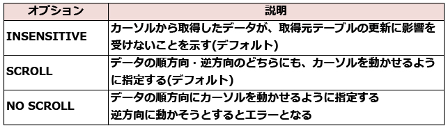 +
オプション２ +
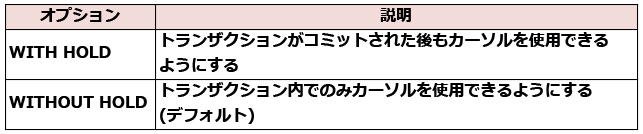 +

(例) +
DECLARE sample_cursor INSENSITIVE CURSOR WITH HOLD FOR SELECT * FROM sample; +
取得元データの更新の影響を受けず、トランザクション実行中のみ有効であるカーソルを作成。

|psql -cオプション
|psqlコマンドの-cオプションは、コマンドラインから直接SQL文やメタコマンドを実行するためのオプションです。 +
-cオプションを使用すると、psqlを起動して対話型のセッションを開始することなく、指定したコマンドを実行できます。 +
例えば、次のように使用します。 +
psql -U ユーザー名 -d データベース名 -c "SELECT * FROM テーブル名" +
この例では、指定したユーザー名とデータベース名でpsqlに接続し、SELECT文を実行しています。 +
ちなみに、上記のコードは以下のように書き換えられる。 +
psql -U ユーザー名  -c "SELECT * FROM テーブル名" データベース名 +

|データベースの停止
|データベースを停止するには、pg_ctlコマンドを使用します。 +
このコマンドは [red]#PostgreSQLの管理ユーザ# がPostgreSQLの稼働するホスト上で行います。rootユーザや、他のユーザは実行できません。

|PostgreSQLの正規表現
|PostgreSQLには、3つの正規表現機能が存在する。 +
主な機能は、LIKE演算子、SIMILAR TO演算子、POSIX正規表現の3つです。 +
**LIKE演算子** +
文字列「全体」に対してパターンマッチングを行う演算子です。 +
主にWHERE句で使用されます。 +
書式は以下の通りです。 +

・大文字と小文字を区別する場合 +
判定対象のカラム名 LIKE 'パターン' +
・大文字と小文字を区別しない場合 +
判定対象のカラム名 ILIKE 'パターン' +

条件のパターンに使用できるメタ文字(通常の文字とは別の特別な意味を持つ文字)は以下の通りです。 +
%：任意の文字列を表す +
_：任意の1文字を表す +
\：直後に記載した文字をメタ文字として認識しない +

[実行例] +
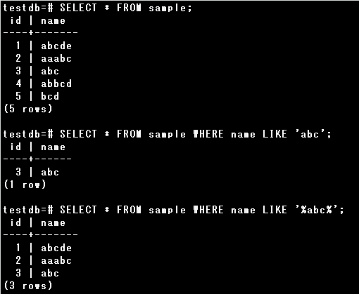

**SIMILAR TO演算子** +
文字列「全体」に対してパターンマッチングを行う演算子であり、正規表現を判定に使用することができます。 +
主にWHERE句で使用されます。 +
書式は以下の通りです。 +

判定対象のカラム名 SIMILAR TO 'パターン'

条件のパターンに使用できるメタ文字は以下の通りです。

%：任意の文字列を表す  +
_：任意の1文字を表す  +
\：直後に記載した文字をメタ文字として認識しない +
｜：左右の条件のうちどちらかを表す +
*：直前の項目に対し、0回以上の繰り返しを表す +
+：直前の項目に対し、1回以上の繰り返しを表す +
?：直前の項目に対し、0回または1回の繰り返しを表す +
{m}：直前の項目に対し、m回の繰り返しを表す +
{m,}：直前の項目に対し、m回以上の繰り返しを表す +
{m,n}：直前の項目に対し、m回からn回の繰り返しを表す +
()：()のパターンのグループ化を表す +
[実行例] +
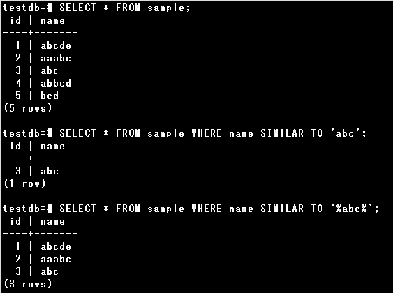

**POSIX正規表現** +
文字列の「一部」に対してパターンマッチングを行う演算子であり、正規表現を判定に使用することができます。 +
主にWHERE句で使用されます。 +
書式は以下の通りです。 +

・大文字と小文字を区別する場合(パターンが一致するかどうか) +
判定対象のカラム名 ~ 'パターン'

・大文字と小文字を区別しない場合(パターンが一致するかどうか) +
判定対象のカラム名 ~* 'パターン'

・大文字と小文字を区別する場合(パターンが一致しないかどうか) +
判定対象のカラム名 !~ 'パターン'

・大文字と小文字を区別しない場合(パターンが一致しないかどうか) +
判定対象のカラム名 !~* 'パターン'

区別するかつパターンが一致する状態がデフォルトで、'~'のみ。 +
そこから否定などが入るといろいろくっついていく。

[実行例] +
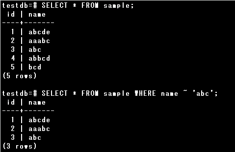

|listen_addressesでパラメータ'*'を設定すると
|'*'を指定した場合は、すべてのIPアドレスで接続を待ち受けます。 +
ちなみに、自身のコンピュータを示すループバックアドレスを指定した場合、同一マシンからの接続以外は受け付けません。

|VACUUMとVACUUM FULL実行時のOSの占有領域の変化
|VACUUMコマンドはOSの占有領域を保持したまま実行できるが、VACUUM FULLは実行時にOSの占有領域を返却する

|postgreSQLの関数におけるオーバーロード
|PostgreSQLにおいて関数のオーバーロードは可能。まったく同じ関数の場合は新しいほうに置き換わる。

|関数の引数がNULLの時の挙動の設定
|・CALLED ON NULL INPUT(デフォルト) +
引数の一部にNULLが含まれていても関数の処理を行います。 +

・RETURNS NULL ON NULL INPUTもしくはSTRICT +
引数の一部にNULLが含まれている場合は、関数の処理を行わずにNULLを返します。 +
(例) +
CREATE OR REPLACE FUNCTION sample_func(TEXT) RETURNS SETOF INTEGER AS \$$ +
SELECT id FROM sample WHERE staff = $1 ORDER BY id LIMIT 2;  +
$$ LANGUAGE SQL STRICT;

|日時から指定したフィールドの値のみを取得する
|日時から指定したフィールドの値のみを取得する際はextract()関数、またはdate_part()関数を使用します。 +
書式は以下の通り +

extract(フィールド from タイムスタンプ値) +
date_part('フィールド', タイムスタンプ値)

extractの場合は'from'が必要であること、 +
date_apartの場合は第一引数に''(アポストロフィー)が付くことに注意

|INTERSECT文
|INTERSECTは言うたらAND演算。ALLをつけたら重複を許可する。 +
ちなみにOR演算はUNION

|postgreSQLの自動コミット
|postgreSQLはデフォルトで自動コミットがONになっている。自動コミットを一時的に無効にするには、BEGINやSTART TRANSACTIONでトランザクションを開始する必要がある。 +
こうして明示的にトランザクションを開始すると、commitやabort、rollbackで明示的に開始したトランザクションが終了するまでは自動commitが無効になる。 +
ちなみに、postgreSQLはトランザクションの開始を書いていなくてもabortやrollbackの記述ができる。 この場合このabortやrollbackは何の意味もなさない。（自動コミットが有効なので、SQL文が実行された時点で処理が確定する）

|バージョンアップとPostgreSQLの停止
|メジャーバージョンアップ、マイナーバージョンアップともに、PostgreSQLを停止させて行う必要があります。 +
メジャーバージョンアップではデータベースの構成ファイルに互換性が無くなる場合があるため、旧バージョンのデータファイルを使用できない可能性があります。 +
また、設定機能などの大きな機能に対する変更は、マイナーバージョンアップでは行われず、メジャーバージョンアップで行われます。

|DIRTY READ, +
FUZZY READ, +
PHANTOM READ
|・DIRTY READ(ダーティリード) +
他トランザクションによって変更された、コミット前のデータを読み込んでしまう現象です。 +
[red]#他トランザクションでのコミット前のUPDATEを読み込んでしまうのがDIRTY READ。#

[実行例]　※PostgreSQLではREAD UNCOMMITTEDの挙動を取らないため、実際は起こりません。
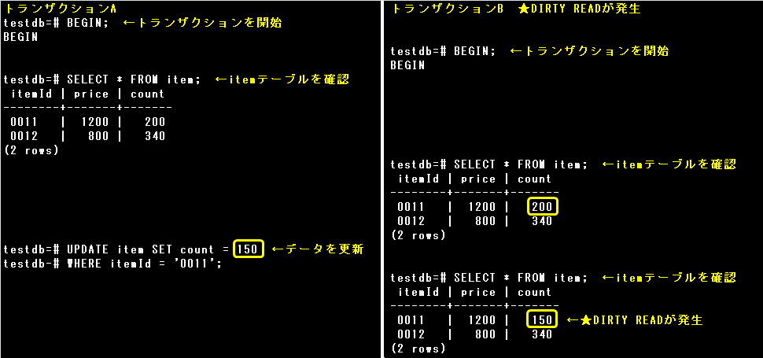

・FUZZY READ(ファジーリード・反復不能読み取り) +
あるデータをトランザクション内で複数回読み込んだ場合に、他トランザクションで対象データの変更・削除がコミットされることによって取得されるデータ内容が変わってしまう現象です。 +
[red]#他トランザクションでのコミット後のUPDATEとDELETEを読み込んでしまうのがFUZZY READ。#

[実行例];
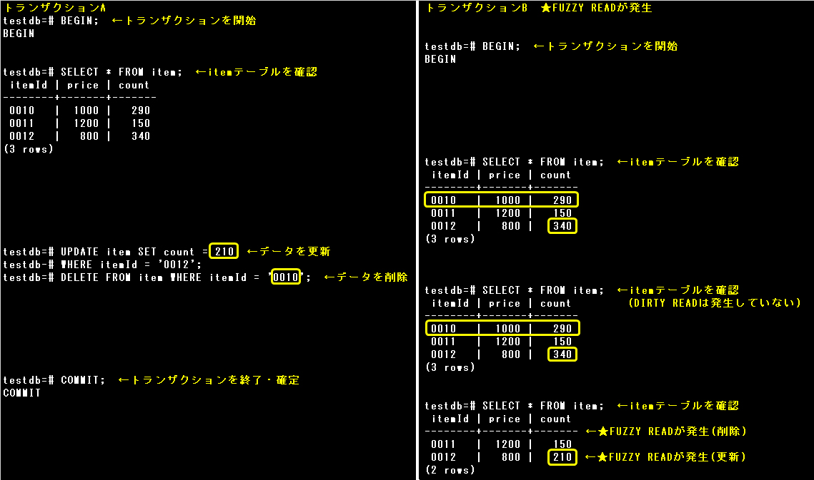

・PHANTOM READ(ファントムリード) +
あるデータをトランザクション内で複数回読み込んだ場合に、他トランザクションでデータの挿入がコミットされることによって以前は取得されなかったデータが取得されてしまう現象です。 +
[red]#他トランザクションでのコミット後のINSERTを読み込んでしまうのがPHANTOM READ。#

[実行例]/
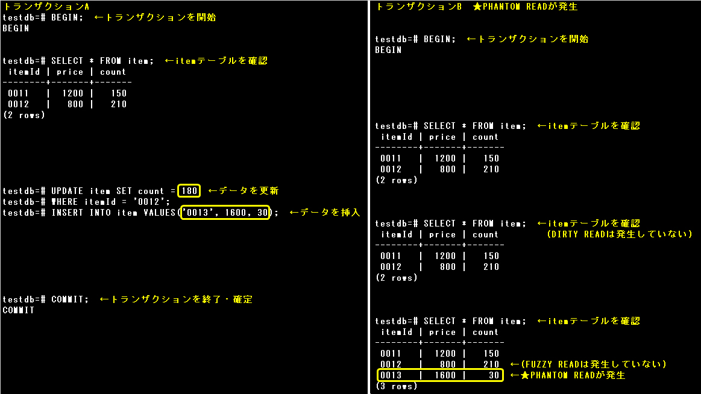

|トランザクションの分離レベル
|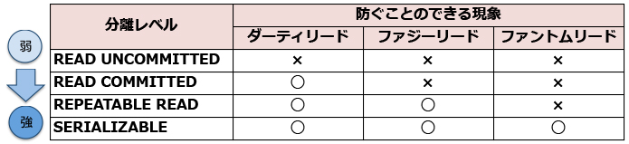

|SETコマンドとpg_ctr restart
|SETコマンドは、実行時パラメータの設定を変更するコマンドです。 +
SETコマンドで設定した設定値は、SESSIONオプションを使用するとコマンドを実行したセッション(PostgreSQLサーバへの接続)内、LOCALオプションを使用するとコマンドを実行したトランザクションのみで有効となります。 +
pg_ctl restartコマンドはPostgreSQLを再起動するため、SETコマンドで設定された値は反映されません。

|GENERATED { ALWAYS \| BY DEFAULT } AS IDENTITY
|ALWAYSの場合は、INSERTの時値を明示的に指定するとエラーになる。 +
BY DEFAULTの場合は明示的に指定した値が格納される +
ちなみに連番の開始番号は 1 +

[\実行例]
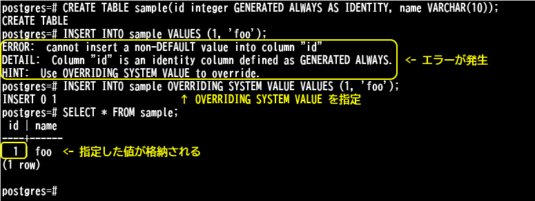

また、BY DEFAULTの場合はupdateで該当カラムの値を変更可能だが、 +
ALWAYSの場合はupdateで該当カラムの値を変更しようとするとエラーが出る。 +
[エラー文] +
ERROR:  column "i" can only be updated to DEFAULT +
DETAIL:  Column "i" is an identity column defined as GENERATED ALWAYS.

|バックアップとデータベースの停止
|pg_dumpやpg_dumpallを使った論理バックアップでは、データベースを停止させる必要はない。 +
また、コマンドの実行が他ユーザのデータベースアクセスを妨げることはない。 +
物理バックアップの場合は、データベースを停止させる必要がある場合がある。 +
また、コマンドの実行が他ユーザのデータベースアクセスを妨げることがある。

|シーケンスとトランザクション
|nextval()関数で一度進められたシーケンス値は、ロールバックを行っても元に戻りません。 +
あ、あとちなみにシーケンスはマイナス値を生成することもできます。また、オプションで設定する増減値にはマイナス値の指定が可能です。増減値をマイナス値にした場合は、指定した数ずつ減らしながら連番を作成します。

|JOIN時のNATURALとUSINGについて
|NATURALでは共通のカラムが自動的に左端に来る（結合キーとなる） +
USINGでは指定したカラムが左端に来る（結合キーとなる） +

|timestamp型とdate型の使い分け
|timestamp型は「日付＋時刻」、date型は「日付のみ」。時刻が必要かどうかで使い分けます。

|PostgreSQLの管理ユーザーが決まるタイミング
|PostgreSQLの管理ユーザー（スーパーユーザー）は、初期化時に initdb を実行したOSユーザー名で自動的に決まります。通常は postgres という名前になります。 +
めちゃくちゃ余談やけど、僕はwindowsのインストーラで入れたから、initdbがインストーラによって自動で行われてる。やからインストーラの設定でPostgreSQLの管理ユーザーを設定した感じやな

|createuserコマンド一覧
|大文字小文字で機能が反対になっているので、注意すること。 +
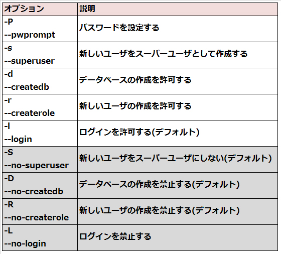

|インデックスに対する操作
|インデックスはデータベースのテーブルとは別で管理されている。 +
そのため、インデックスの削除や名前の変更をする場合は、テーブル名などは指定する必要はなく、インデックス名のみでいい。

|JOIN系で'ALL'は指定できる?
|できません。JOINはそもそも「一致するすべての組み合わせを返す」ため、重複はデフォルトで出力されるのです。 +
逆に重複をまとめるとかの制御もJOIN単体ではできないので注意

|サーバホストでしか起動できないコマンド、そうでないコマンド
|物理操作系（initdb, pg_ctlなど）＝サーバホスト限定 +
論理操作系（pg_dump, psqlなど）＝クライアントからも可能 +

PostgreSQLは「サーバ型アーキテクチャ」なので、クライアントからはSQLを通じて論理操作しかできません。 +
pg_ctl や initdb は「物理操作（ファイル・プロセス）」なので、OSの権限とファイルアクセスが必要になります。 +

[cols="^.^1,^.^3,3", options="header"]
!===
!コマンド !実行環境 !用途・補足
!pg_ctl	!サーバホスト限定	!サーバの起動・停止・再起動。データディレクトリに直接アクセス
!initdb	!サーバホスト限定	!新しいクラスタの初期化。ファイルシステム操作
!postgres	!サーバホスト限定	!PostgreSQLサーバ本体の起動。OSプロセスとして動作
!pg_resetwal	!サーバホスト限定	!WALログのリセット。クラッシュ復旧用
!pg_checksums	!サーバホスト限定	!チェックサムの有効化・検証。データファイル操作
!pg_upgrade	!サーバホスト限定	!バージョンアップ時のクラスタ移行。旧・新両方のデータディレクトリにアクセス
!pg_basebackup	!サーバホスト限定（通常）	!物理バックアップ。replication権限があれば一部リモート可能
!vacuumdb --analyze-in-stages	!サーバホスト限定	!特殊オプション付きの統計収集。一部制限あり
!===

[cols="^.^1,^.^3,3", options="header"]
!===
!コマンド !他ホストでも実行可能 !用途・補足
!pg_dump	!✅	!論理バックアップ。-hでリモート接続可能
!pg_restore	!✅	!バックアップのリストア。ローカルでファイルを扱う
!psql	!✅	!SQL実行・メタコマンド操作。リモート接続可能
!createdb, dropdb	!✅	!DB作成・削除。リモートでもOK
!vacuumdb	!✅	!通常のバキューム処理。リモートでもOK
!reindexdb, clusterdb	!✅	!インデックス再構築・クラスタリング。リモートでもOK
!pg_isready	!✅	!接続確認。-h指定でリモート確認可能
!===

|データベースクラスタについて
|データベースクラスタは、PostgreSQLサーバ(プロセス群やサービス)と1対1で対応します。ですから、複数のサーバで1つのデータベースクラスタを分散管理することはできません。 +
ただし、PostgreSQLサーバは1台のマシンに複数を同時に稼働させることができるので、1台のマシンで複数のデータベースクラスタを運用することはできます。

|create~dropでないもの
|[cols="^.^1,^.^1,^.^1,^.^1", options="header"]
!===
!対象	!作成構文	!削除構文	!用途・補足
!カーソル	!DECLARE cursor_name CURSOR FOR ...	!CLOSE cursor_name または DEALLOCATE cursor_name	 !SELECT結果を逐次処理するための一時的なポインタ
!プリペアドステートメント	!PREPARE stmt_name AS ...	!DEALLOCATE stmt_name	!SQL文の事前定義。高速化や再利用に使う
!匿名プリペアドステートメント	!EXECUTE 'SQL文'	!自動的に解放（明示的な DEALLOCATE は不要）	!一時的な実行。名前を付けない場合は自動管理
!セッション一括解放	!DISCARD ALL	!DEALLOCATE 相当の一括破棄	!TEMPテーブル・PREPARE文・カーソルなどをまとめて解放
!===

|トリガーのタイミングを決定するイベントとして、指定できないもの
|トリガーはテーブルに更新処理が実行されたときにのみ、発火させることができる。 +
そのため、INSERT、UPDATE、DELETE、TRUNCATEは発火タイミングとして設定できるが、SELECTは発火タイミングとして設定できない

|トランザクション内でエラーが発生した場合
|トランザクション内でエラーが発生した場合、ROLLBACKコマンドが実行されるまで全てのSQLはエラーとなり、トランザクション内の処理は取り消されます。これはトランザクションのACID特性のうち、Atomicity(原子性)によるものです。

[例]/
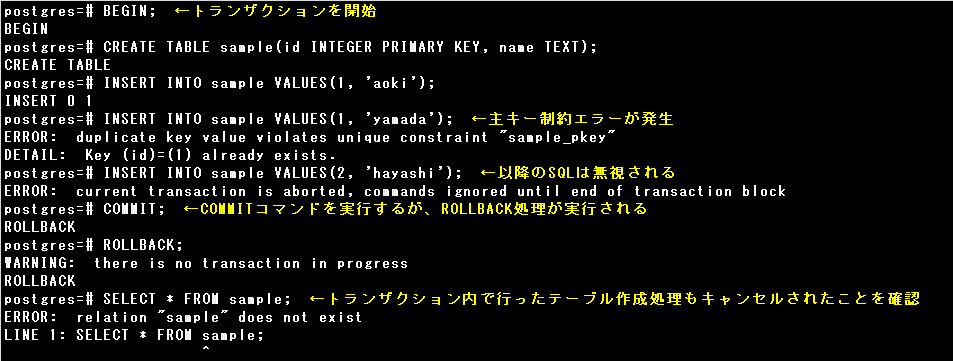

|CREATE FUNCTIONやCREATE PROCEDUREなどで見られる"$$"について
|(例) +
CREATE PROCEDURE funcX(VARCHAR) AS $$ +
INSERT INTO customer_log VALUES($1, CURRENT_DATE, 'shopA'); +
$$ LANGUAGE SQL; +

\$$ ... $$ は「ここからここまでがソースコードですよ」という単なる区切り記号である。その中に書かれている INSERT INTO ... が「手続き本体」となる。

|関数の戻り値が単数か複数化を見分ける
|RETURNSの後にSETOFが付いていれば複数。 ついていなければ単数

|FUNCTIONとPROCEDUREの違い
|FUNCTIONは必ず戻り値を"RETURNS"で明記する必要がある。 +
void の場合は"RETURNS void"。 +
PROCEDUREは戻り値が無いことが確定している。 void のみ。 +
確定しているのでRETURNSなどは書かなくていい。

|SQLでのクロス結合
|SQL で JOIN を書かずにテーブルをカンマ区切りで並べた場合は、暗黙的に クロス結合（直積） になります。

🔍 具体的にいうと +

SELECT * 
FROM shopA_shoes, shopB_shoes; +
JOIN 条件が無いので、両テーブルの 全行の組み合わせ が生成されます。

つまり、shopA_shoes の行数を nA、shopB_shoes の行数を nB とすると、結果は nA × nB 行。

これは CROSS JOIN と同じ意味です。

✅ 例
shopA_shoes に 5 行

shopB_shoes に 8 行

の場合、結果は 5 × 8 = 40 行になります。

✨ 設計美的ポイント
OSS-DB 試験や実務では「カンマ区切りは古い書き方」とされ、意図が不明瞭になりがちです。

明示的に書くならこうする方が安全で美しいです：

SELECT * 
FROM shopA_shoes
CROSS JOIN shopB_shoes;

|PostgreSQL配布時の無保証記載について
|Postgreを配布する際は、無保証であることを記載する必要がある。 +
結論：PostgreSQLライセンスにおける「無保証」とは、ソフトウェアが“現状のまま”提供され、開発者や配布者がその品質・性能・適合性・損害賠償責任などを一切保証しないことを明記するものです。 以下説明。

🔍 無保証であることの具体的な意味 +
PostgreSQLは「PostgreSQL License」（BSD系ライセンスの一種）を採用しており、以下のような免責事項が含まれています：

動作保証なし ソフトウェアが期待通りに動作することは保証されない。 

品質保証なし バグがない、完全である、特定の目的に適合する、といった保証はない。

損害賠償責任なし ソフトウェアの使用や不具合によって生じた直接的・間接的な損害について、開発者や配布者は責任を負わない。

商用利用における保証なし 商用利用や業務利用においても、性能や安全性について保証されない。

🧠 背景
PostgreSQLはオープンソースであり、誰でも自由に利用・改変・再配布できます。

その代わりに、「保証は一切ない」ことを明記することで、開発者や配布者が法的責任を負わないようにしているのです。

これはBSD系ライセンスの基本的な考え方であり、MITライセンスなども同様の免責条項を持っています。

🎨 まとめ
PostgreSQLの「無保証」とは、

動作・品質・適合性・損害賠償の一切を保証しない ということを明記するものです。

つまり、利用者は「現状のまま」ソフトウェアを受け取り、問題があれば自己責任で対応する必要があります。

|SELECT COUNTでNULLを数えるか
|COUNT(*) +
→ テーブルの全行数を返します。列の値が NULL かどうかは関係ありません。 +
→ つまり「行が存在する」こと自体を数えるので、NULL も 1 行としてカウントされます。

COUNT(column_name) +
→ 指定した列の NULL でない値だけをカウントします。 +
→ 例えば COUNT(price) なら、price が NULL の行は除外されます。 +

(例)

sample テーブル +
+----+--------+ +
\| id \| value  \| +
+----+--------+ +
\| 1  \| 'A'    \| +
\| 2  \| NULL   \| +
\| 3  \| 'B'    \| +
+----+--------+ +

SELECT COUNT(*) FROM sample;   -- 結果: 3 +
SELECT COUNT(value) FROM sample; -- 結果: 2

|ROLE と USER の違い
|CREATE USER は CREATE ROLE ... LOGIN の糖衣構文です。違いは「デフォルトでログイン権限が付くかどうか」だけです。 +
つまり、 CREATE USER test; は CREATE ROLE test WITH LOGIN; をしている。

🔑 詳細な違い
CREATE ROLE

デフォルトでは NOLOGIN（ログイン不可）。

権限や所有者をまとめる「抽象的な主体」として作られる。

必要なら WITH LOGIN を付けてログイン可能にできる。

PostgreSQL 8.1 以降で導入された、より一般的なコマンド。

CREATE USER

内部的には CREATE ROLE ... LOGIN と同じ。

デフォルトで LOGIN 権限が有効。

つまり「ログインできる ROLE」を作るための別名。

PostgreSQL ドキュメントでも「CREATE USER は CREATE ROLE の別名」と明記されている

PostgreSQLでは内部的にはすべて ROLE で統一。

[red]#CREATE USER は単なる糖衣構文で、LOGIN 属性付き ROLE を作るだけ#

|[red]#リダイレクトを使ったバックアップとリストア#
|pg_dumpでは-fオプションを指定しないで、標準出力のリダイレクトを使った方法がよくつかわれる。 +
(例) +
pg_dump mydb > backup.sql +
これは実質的に"pg_dump -f backup.sql mydb"を実行しているのと同じ。 +

次にリストアについて書く。 +
リストアでリダイレクトを使用したい場合は、pg_restoreではなく、psqlを使用する。 +
(例) +
psql -d newdb < backup.sql

(まとめ)
リダイレクトを使ったバックアップとリストア +
pg_dump -Fp mydb > backup.sql +
psql -d newdb < backup.sql

|FROM句で副問い合わせをする場合
|FROM句で副問い合わせを使用する場合は、FROM句の副問い合わせに対して別名をつける必要がある +

(例) +
SELECT sub.department, sub.count +
FROM ( +
    SELECT 部署 AS department, COUNT(*) AS count +
    FROM member +
    GROUP BY 部署 +
) AS sub; +

(...) AS sub の部分が必須。 +
sub は任意の名前でよく、ここで定義した名前を外側のSELECTで参照します。

|INHERITS(継承)
|あるテーブルを親テーブルとした場合、継承という機能を用いると親テーブルの定義も引き継いだテーブル(子テーブル)を定義することができます。子テーブルには親テーブルにない定義を追加することも可能です。さらに、子テーブルに存在するデータを親テーブルの検索から取得することができるようになります。 +

(例)
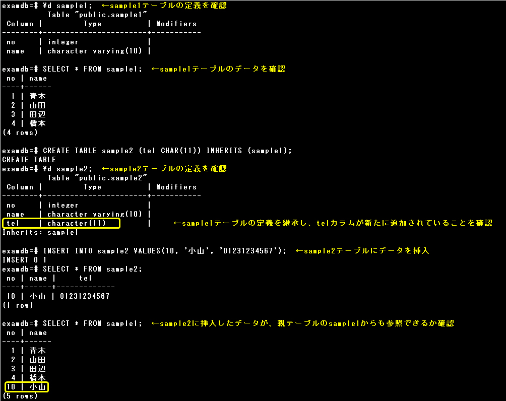 +
重要なのは、sample2テーブルを作成する際に、カラムの作成においてtelカラムの作成しかしていないこと。 +
INHERITSを使えば親のカラムは引き継げるので、子にのみ実装したいカラムを作成するだけでいい。 +

|killコマンド同等機能一覧
|・TERM(pg_ctl stop -m smartと同じ処理) +
全てのクライアント接続が切断されるまで待ってからシャットダウンします。

・INT(pg_ctl stop -m fastと同じ処理) +
高速シャットダウンし、実行中のトランザクションの処理が開始した時の状態に戻します(ロールバックします)。

・QUIT(pg_ctl stop -m immediateと同じ処理) +
実行中のトランザクションを実行前の状態に戻すロールバックなどの終了処理を行わずにサーバープロセス自体を停止します。サーバのプロセスがクラッシュして停止したのと同じなので、次回起動時に回復処理を実行するためサーバに負荷がかかります。

・HUP(pg_ctl reloadと同じ処理) +
設定ファイルを再読み込みします。

|情報スキーマとシステムカタログ
|データベースクラスタに関する情報は、「情報スキーマ」と「システムカタログ」で確認することができます。それぞれの特徴は以下の通りです。

■情報スキーマ
データベースオブジェクトに関する定義情報を含むスキーマ(データベース内で、テーブルなどのオブジェクトを格納している名前空間)です。

特徴は以下の通りです。 +
・スキーマの名称は「information_schema」である +
・SQLの標準規格に当てはまるので、移植性が高い +
・ビュー(SQL文のSELECT結果を基にして定義する仮想のテーブル)とテーブルのグループである +
・データベースクラスタの作成時に作られたスーパーユーザに所有される +
・参照に特別な設定や権限は不要である +

【情報スキーマの主なビュー】 +
・tables  +
publicスキーマ(デフォルトで作成され、スキーマ指定をしないオブジェクトを格納するスキーマ)内を含む、全てのテーブルとビューの一覧を格納している。
(実行例)
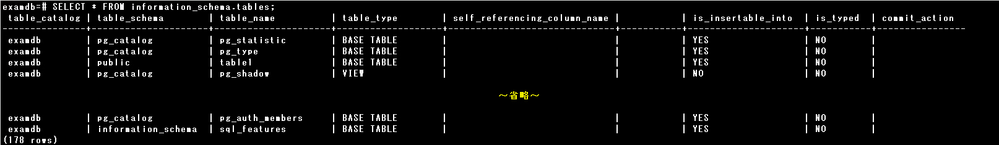

■システムカタログ
データベースの内部情報を格納したPostgreSQL固有のテーブルです。

特徴は以下の通りです。 +
・スキーマの名称は「pg_catalog」である(暗黙的に必ず検索パスに含まれるため、スキーマの指定は省略することが可能。) +
・情報スキーマより詳細な情報を確認する際に使用する +
・データベースクラスタの管理に関する情報を含む +
・SQLの標準規格には当てはまらないので、移植性が低い +

【PostgreSQLの主なシステムカタログ】
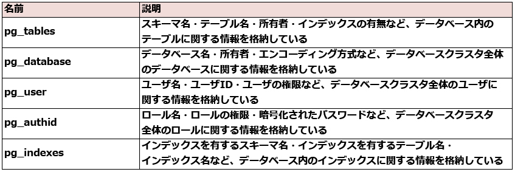

(実行例)
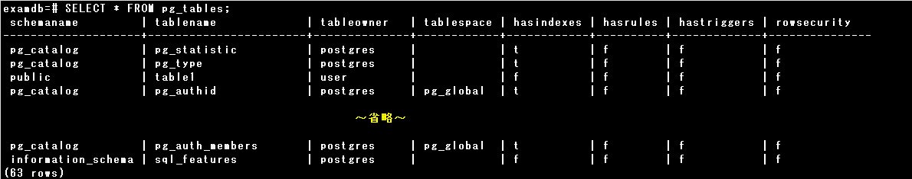

|ALTER SYSTEMコマンドについて
|postgreSQLの設定を変更するにはpostgre.confを手動で直接いじるか、ALTER SYSTEM コマンドを使う方法がある。 +
「postgresql.auto.conf」は、バージョン9.4で新機能として追加された、ALTER SYSTEMコマンドによって操作されるファイルです。 +
ALTER SYSTEMコマンドでパラメータ値を設定すると、自動的に「postgresql.auto.conf」ファイルに書き込まれます。「postgresql.auto.conf」ファイルの内容は、「postgresql.conf」ファイルの読み込み時に上書きされるため、同じパラメータが設定されている場合は「postgresql.auto.conf」ファイルの内容が優先されます。 +
ALTER SYSTEMコマンドは比較的最近できたコマンドである。 +
ALTER SYSTEMコマンドが生まれた背景について説明する。 +

🎯 背景と課題 +
従来の方法 PostgreSQL 9.3 以前は、サーバ全体の設定を変えるには postgresql.conf を直接編集するしかありませんでした。

* OSレベルのファイル編集権限が必要
* 編集ミスで構文エラーが出ると起動できなくなる
* 自動化やツール連携が難しい

課題感 +
大規模運用やクラウド環境では「SQLから一貫して設定を変更したい」「管理者がリモートで安全に操作したい」というニーズが高まっていました。

🚀 ALTER SYSTEM 導入の目的 +
安全性

* SQL文として構文チェック済みで postgresql.auto.conf に書き込まれるため、誤編集のリスクが減る。
* 一貫性 DBAがSQLだけで設定変更できるので、権限管理をDB内に閉じ込められる。
* 自動化 運用スクリプトや管理ツールから直接SQLで設定変更できる。クラウドやコンテナ環境で特に有効。

🕰️ 歴史的タイミング +
PostgreSQL 9.4 (2014年12月) で追加。

ちょうどクラウド利用が急速に広がり始めた時期で、「設定管理もSQLで完結させたい」という流れに合致していました。

|ロジカルレプリケーションについて
|まず、大前提としてサブスクライバーはパブリッシャーが転送するテーブルと同じ定義のテーブルを手動で作成しておかないといけない。 +

パブリッシャー側は、作成しようとするパブリケーション名が既に存在する場合、エラーとなります。重複しない名称を指定する必要があります。 +

サブスクライバー側は CREATE SUBSCRIPTION ~~ の最後にWITH(enabled = false)を指定することで、「サブスクリプションは作成されるが、レプリケーションの動作は開始されない」という状態を作ることができる。 +
この状態ではパブリッシャーからテーブル情報が送信されないので、テーブル情報が一致しない

|PostgreSQLでの入れ子トランザクション
|PostgreSQLは入れ子のトランザクションに対応していない。 +
だから、BEGIN;を宣言した後にさらに続けてBEGIN;を宣言するのはもちろん不可能だし、 +
BEGIN;の後に CALL sample_proc();でPROCEDUREを呼び出した際、このPROCEDUREが内部でBEGIN;を宣言している場合はエラーとなる。

|PITRのバックアップ単位
|PITRははデータベースクラスタ全体をバックアップ対象とします。 +
テーブル単位のバックアップはできない。

|PITR手順
|PITRは以下のような手順で使用します。 +
1) 事前設定 +
2) ベースバックアップ +
3) リカバリ +
事前設定では「postgresql.conf」ファイルにおいて、ログファイルをアーカイブして保存する設定を行います。また、リカバリ時には「recovery.signal」ファイルを作成して配置します。 +
「postgresql.conf」ファイルにおいて、リカバリポイントを指定することができます。 +
PITRで使用するバックアップは物理バックアップであるため、OSコマンドのtarやrsyncコマンド、pg_basebackupコマンドなどを使用します。

|ログレベル
|INFO…ユーザから出力を要求された情報 +
NOTICE…ユーザにとって役立つ情報 +
WARNING…不適切なコマンド使用等に対するユーザへの警告 +
ERROR…特定のコマンドを中断させたエラー +
LOG…データベース管理者にとって役立つ、パフォーマンスや内部の処理に関する情報 +
FATAL…特定のセッションを中断させたエラー +
PANIC…全てのセッションを中断させた致命的なエラー

|GRANTで付与できる権限
|SELECT・INSERT・UPDATE・DELETE・TRUNCATE・REFERENCES・TRIGGER・CONNECT・CREATE +
基本的にはDMLがメイン。 なぜならそれ以上の権限を一般ユーザーに与えるべきではないから。 +
TRRIGERも、作成はできても削除はできない。 +
テーブル削除関連も、DELETEやTRUNCATEは許可してもDROPまでは許可しない。
DDLのTRANCATEがあることと、同じくDDLであるALTERが無いことが盲点なので注意。

（さらに詳しく） +
【主な権限】 +
・SELECTとCOPY TOの実行を許可する(SELECT) +
・INSERTとCOPY FROMの実行を許可する(INSERT) +
・UPDATEの実行を許可する(UPDATE) +
・DELETEの実行を許可する(DELETE) +
・TRUNCATEの実行(テーブルの全データを高速で削除)を許可する(TRUNCATE) +
・外部キー制約を作成することを許可する(REFERENCES) +
・トリガーの作成を許可する(TRIGGER) +
・データベースへの接続を許可する(CONNECT) +
・データベースに対するスキーマの作成を許可する(CREATE) +
・スキーマに対するオブジェクトの作成を許可する(CREATE)

|PITRでテーブル単位の指定は可能か？
|結論 ： 不可。 +
PITRで使うpg_bacebackupやpg_start_backupにはそもそもテーブル名を指定する場所がない。 pg_start_backupの第一引数にはラベル名を入れる場所があるので、テーブル名と混同しないこと。 以下、pg_start_backupの引数 +

pg_start_backup(バックアップラベル名 [, ファストモード [, 排他または非排他]] )

・第1引数（バックアップラベル名）: 任意のバックアップラベル名を指定する　※必須 +
・第2引数（ファストモードの指定）: trueまたはfalseを指定する。trueを指定すると、サーバ上の利用可能なリソースを可能な限り使用して即時にチェックポイントが実行される（デフォルトはfalse） +

・第3引数（排他または非排他を指定）: trueまたはfalseを指定する。trueを指定すると「排他モード」、falseを指定すると「非排他モード」で実行される（デフォルトはtrue）

|PostgreSQL ユーティリティ vs SQLペア一覧
|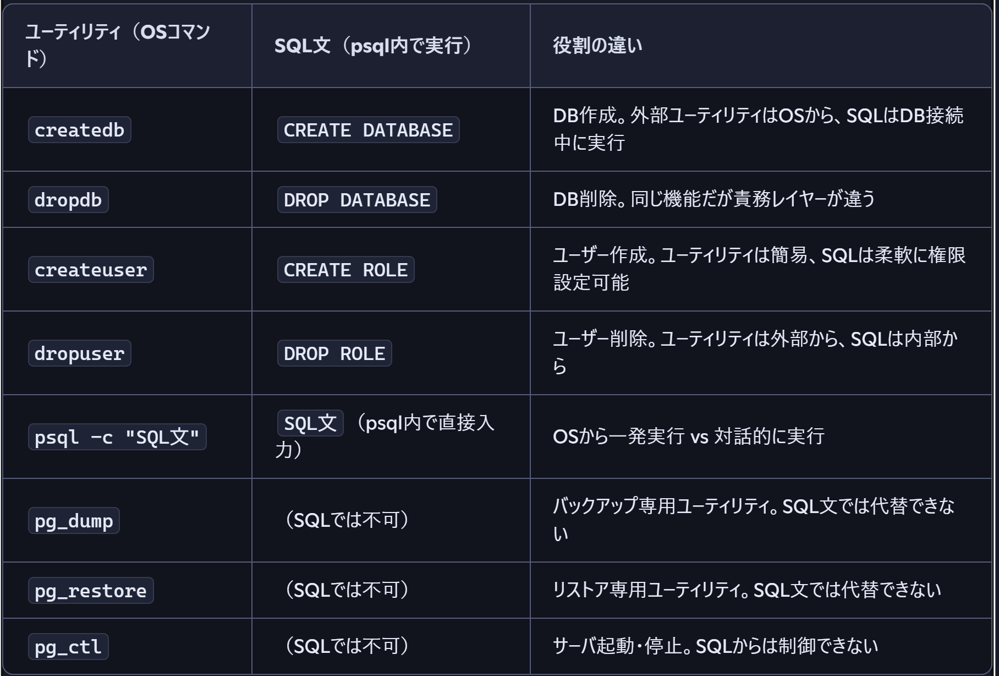

|トランザクション内でエラーが起きた場合
|トランザクション内でエラーが発生した場合はロールバック以外の処理を受け付けなくなり、トランザクション内の処理は全て取り消されます。

